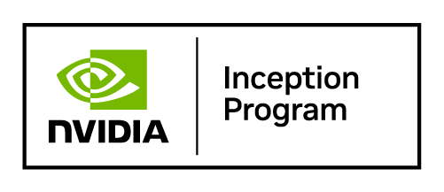

## Post-Transformer Intelligence, From Edge to Cloud

Phase-TITAN is a post-transformer architecture with constant memory: enabling real-time intelligence on every device. 

---

### Phase-TITAN

A deterministic dynamical system that replaces the transformer's attention + KV-cache design. Constant state representation at any context length (measured on Rust CPU inference engine). Under such deterministic regime, Phase-TITAN enables mesh intelligence. Devices share only compact direction vectors while all raw data stays on-device.

[Watch: First KV cache-free agentic sLM proof](https://youtube.com/shorts/E-jFYuVTrjk?feature=share)

---

Contact: [contact@traceweave.net](mailto:contact@traceweave.net)

  &nbsp;&nbsp;&nbsp;&nbsp;
  

